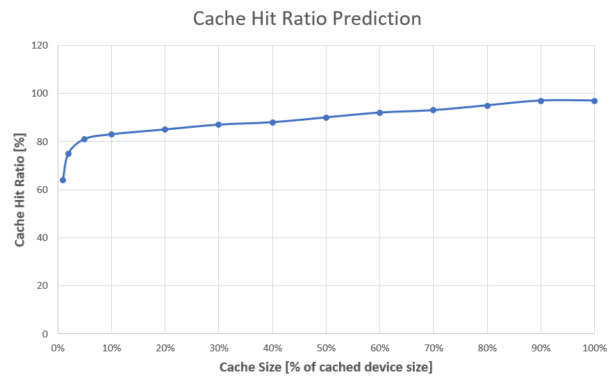

# Standalone Linux IO Tracer Case Study

## Introduction

Standalone Linux IO Tracer (iotrace) is a tool for block device I/O tracing
and management of created traces. In this document you will find out detailed
description how to use it and a few examples of collected traces analytics.

From high-level perspective, for each I/O to target device(s) basic metadata
information is captured (IO operation type, address, size), supplemented with
extended classification. Extended classification contains information about I/O
type (direct / filesystem metadata / file) and target file attributes(e.g. file
size). Afterwards traces can later be converted to JSON or CSV format and
consumed by any further analytics. iotrace does it and extends outputs with
post-processing fields like IO latency, IO queue depth, and more.

iotrace is based on [Open CAS Telemetry Framework (OCTF)](https://github.com/Open-CAS/open-cas-telemetry-framework). Collected traces are stored in format defined by OCTF using Google
Protocol Buffers description. You can find this definition [here](https://github.com/Open-CAS/open-cas-telemetry-framework/blob/master/source/octf/proto/trace.proto). Such trace format allows to analyze
it by any kind of tool written in Java, C++, Python, or other languages
(supported by Protocol Buffer)

The goodness of OCTF can be reused by other storage applications for instance
SPDK, QEMU. They can produce IO traces in the same OCTF traces format, which can
be used by the same analytics tools. But these are next steps.

## Getting traces

The iotrace [README](https://github.com/Open-CAS/standalone-linux-io-tracer/blob/master/README.md)
contains basic information how to install iotrace on your machine. Please follow
this instruction. Let's get a trace. Any time you can call the tool's help:

~~~{.sh}
iotrace --help
Usage: iotrace [module] command [options...]

Available modules:
     -C    --trace-config                        Manages trace configuration
     -M    --trace-management                    Manages available traces
     -P    --trace-parser                        Parses traces

Available commands:
     -H    --help                                Prints help
     -S    --start-tracing                       Starts IO tracing
     -V    --version                             Prints version

~~~

To start trace collection use _--start-tracing_ command. Command usage:

~~~{.sh}
Usage: iotrace --start-tracing  --devices <VALUE>[,VALUE]  [options...]

Start IO tracing

Options that are valid with {-S | --start-trace}
     -b    --buffer <1-1024>                     Size of the internal trace buffer (in MiB) (default: 100)
     -d    --devices <VALUE>[,VALUE]             Paths of devices to be traced
     -l    --label <VALUE>                       User defined label
     -s    --size <1-100000000>                  Max size of trace file (in MiB) (default: 1000)
     -t    --time <1-4294967295>                 Max trace duration time (in seconds) (default: 4294967295)
~~~

Let's say, your workload/application is running on top of two block devices.
We would like to trace them for 1 hour, or until trace file is 1GiB. Also you
can label the trace with your name. We are going to call:

~~~{.sh}
sudo iotrace --start-tracing --devices /dev/nvme0n1,/dev/nvme1n1 --time 3600 --size 1024 --label "My cool first trace"
~~~

But any time you can interrupt the trace collection by pressing Ctrl+C or sending 
termination signal to the iotrace process. After the tracing has stopped you
should get a trace summary: 

~~~{.sh}
{
 "tracePath": "kernel/2019-08-13_12:35:22",
 "state": "COMPLETE",
 "sourceNode": {
  "node": [
   {
    "id": "kernel"
   }
  ]
 },
 "traceStartDateTime": "2019-08-13 12:35",
 "traceDuration": "174",
 "traceSize": 3,
 "tracedEvents": "82906",
 "droppedEvents": "0",
 "queueCount": "16",
 "label": "My cool first trace"
}
~~~

Remember your trace path **kernel/2019-08-13_12:35:22**. We will use it for further
processing.

## Parsing traces

The iotrace parser converts IO traces from binary format to CSV or JSON format.
To parse you trace we are going to invoke _--parse-trace_ command from
_--trace-parsing_ module.

~~~{.sh}
iotrace --trace-parser --io --help
Usage: iotrace --trace-parser --io  --path <VALUE>  [options...]

Parse trace files to human readable form

Options that are valid with {-P | --parse-trace}
     -f    --format {json|csv}                   Format of printed output, json - JSON output (default), csv - CSV output
     -p    --path <VALUE>                        Path to trace
     -r    --raw                                 Present trace as it had been recorded without post processing
~~~
  
To get CSV, call:

~~~{.sh}
iotrace --trace-parser --io --path kernel/2019-08-13_12:35:22 --format csv
~~~

You should get the CSV output:

~~~{.sh}
device.id,device.name,device.partition,file.eventType,file.id,file.offset,file.path,file.size,header.sid,header.timestamp,io.error,io.flush,io.fua,io.ioClass,io.latency,io.lba,io.len,io.operation,io.qd,io.writeHint
...
8388608,sda,8388608,,,,,,48,5082383915,false,false,false,1,145584,193227744,8,Write,16,0
8388608,sda,8388608,,,,,,65,5082575353,false,false,false,0,85643,0,0,Write,1,0
8388608,sda,8388608,,,,,,67,5082674546,false,false,true,1,95763,193227752,8,Write,1,0
8388608,sda,265289728,Access,1706144,0,/var/lib/PackageKit/transactions.db,64,69,5083009634,false,false,false,13,121461,176554232,8,Write,1,0
8388608,sda,265289728,Access,1706144,40,/var/lib/PackageKit/transactions.db,64,72,5083018301,false,false,false,13,126345,176554272,8,Write,2,0
8388608,sda,8388608,,,,,,76,5083155359,false,false,false,0,119120,0,0,Write,1,0
8388608,sda,265289728,Access,1704686,0,/var/lib/dnf/history.sqlite,1520,78,5088873278,false,false,false,15,227152,176422616,32,Read,1,0
8388608,sda,265289728,Access,1704687,0,/var/lib/dnf/history.sqlite-shm,0,83,5089530676,false,false,false,11,229684,176423616,8,Read,1,0
8388608,sda,265289728,Access,1704688,0,/var/lib/dnf/history.sqlite-wal,11965,87,5089910485,false,false,false,17,110146,176423680,32,Read,1,0
8388608,sda,265289728,Access,1704688,32,/var/lib/dnf/history.sqlite-wal,11965,91,5090073317,false,false,false,17,90240,176423712,64,Read,1,0
8388608,sda,265289728,Access,1704688,96,/var/lib/dnf/history.sqlite-wal,11965,94,5090177953,false,false,false,17,109399,176423776,128,Read,1,0
...
~~~

And in case of JSON the output is:

~~~{.sh}
...
{"header":{"sid":"48","timestamp":"5082383915"},"io":{"lba":"193227744","len":8,"ioClass":1,"operation":"Write","latency":"145584","qd":"16"},"device":{"id":"8388608","name":"sda","partition":"8388608"}}
{"header":{"sid":"65","timestamp":"5082575353"},"io":{"operation":"Write","latency":"85643","qd":"1"},"device":{"id":"8388608","name":"sda","partition":"8388608"}}
{"header":{"sid":"67","timestamp":"5082674546"},"io":{"lba":"193227752","len":8,"ioClass":1,"operation":"Write","fua":true,"latency":"95763","qd":"1"},"device":{"id":"8388608","name":"sda","partition":"8388608"}}
{"header":{"sid":"69","timestamp":"5083009634"},"io":{"lba":"176554232","len":8,"ioClass":13,"operation":"Write","latency":"121461","qd":"1"},"device":{"id":"8388608","name":"sda","partition":"265289728"},"file":{"id":"1706144","size":"64","path":"/var/lib/PackageKit/transactions.db","eventType":"Access"}}
{"header":{"sid":"72","timestamp":"5083018301"},"io":{"lba":"176554272","len":8,"ioClass":13,"operation":"Write","latency":"126345","qd":"2"},"device":{"id":"8388608","name":"sda","partition":"265289728"},"file":{"id":"1706144","offset":"40","size":"64","path":"/var/lib/PackageKit/transactions.db","eventType":"Access"}}
{"header":{"sid":"76","timestamp":"5083155359"},"io":{"operation":"Write","latency":"119120","qd":"1"},"device":{"id":"8388608","name":"sda","partition":"8388608"}}
{"header":{"sid":"78","timestamp":"5088873278"},"io":{"lba":"176422616","len":32,"ioClass":15,"latency":"227152","qd":"1"},"device":{"id":"8388608","name":"sda","partition":"265289728"},"file":{"id":"1704686","size":"1520","path":"/var/lib/dnf/history.sqlite","eventType":"Access"}}
{"header":{"sid":"83","timestamp":"5089530676"},"io":{"lba":"176423616","len":8,"ioClass":11,"latency":"229684","qd":"1"},"device":{"id":"8388608","name":"sda","partition":"265289728"},"file":{"id":"1704687","path":"/var/lib/dnf/history.sqlite-shm","eventType":"Access"}}
{"header":{"sid":"87","timestamp":"5089910485"},"io":{"lba":"176423680","len":32,"ioClass":17,"latency":"110146","qd":"1"},"device":{"id":"8388608","name":"sda","partition":"265289728"},"file":{"id":"1704688","size":"11965","path":"/var/lib/dnf/history.sqlite-wal","eventType":"Access"}}
{"header":{"sid":"91","timestamp":"5090073317"},"io":{"lba":"176423712","len":64,"ioClass":17,"latency":"90240","qd":"1"},"device":{"id":"8388608","name":"sda","partition":"265289728"},"file":{"id":"1704688","offset":"32","size":"11965","path":"/var/lib/dnf/history.sqlite-wal","eventType":"Access"}}
{"header":{"sid":"94","timestamp":"5090177953"},"io":{"lba":"176423776","len":128,"ioClass":17,"latency":"109399","qd":"1"},"device":{"id":"8388608","name":"sda","partition":"265289728"},"file":{"id":"1704688","offset":"96","size":"11965","path":"/var/lib/dnf/history.sqlite-wal","eventType":"Access"}}
...
~~~

## What do we collect, What do we process?

The below table contains telemetry content which is traced by iotrace. We also
included our future plans for tracing.

<table class="tg">
  <tr>
    <th>Category</th>
    <th>Telemetry Content</th>
    <th>Post processing information</th>
    <th>Status</th>
  </tr>
  <tr>
    <td>Basic IO metadata</td>
    <td>- Operation Type (Read/Write/Discard/Flush) - IO Address (LBA) - IO Length - IO Result - IO write Hint - IO Class</td>
    <td>- IO Latency - IO Queue Depth</td>
    <td>Implemented</td>
  </tr>
  <tr>
    <td>Filesystem metadata</td>
    <td>- File Id - File Offset - File Name</td>
    <td>- File Path</td>
    <td>Implemented</td>
  </tr>
  <tr>
    <td>Filesystem events</td>
    <td>- Dirs and files creation, moving, removal - Dirs and files attributes  </td>
    <td></td>
    <td>Implemented</td>
  </tr>
  <tr>
    <td>Filesystem events</td>
    <td>- Dirs and files renaming - Dirs and files attributes  </td>
    <td></td>
    <td>Future</td>
  </tr>
  <tr>
    <td>Application metadata</td>
    <td>- Process ID - Process Name - Application IO context</td>
    <td></td>
    <td>Future</td>
  </tr>
  <tr>
    <td>System Calls</td>
    <td>- Read/Write/Flush/etc. system calls </td>
    <td></td>
    <td>Future</td>
  </tr>
  <tr>
    <td>And many more</td>
    <td></td>
    <td></td>
    <td></td>
  </tr>
</table> 

## IO Trace Analysis

### Statistics

Having IO trace, you can get basic IO statistics. To get it, please call:

~~~{.sh}
iotrace --trace-parser --statistics --path kernel/2019-08-13_12:35:22 --format json
~~~

The JSON output as following:

~~~{.sh}
{
 "statistics": [
  {
   "desc": {
    "device": {
     "id": "271581184",
     "name": "nvme1n1",
     "size": 732585168
    }
   },
   "duration": "72732345281",
   "read": {
    "size": {
     "unit": "sector",
     "avarage": "18",
     "min": "1",
     "max": "256",
     "count": "243",
     "total": "4610"
    },
    "latency": {
     "unit": "ns",
     "avarage": "21683",
     "min": "8040",
     "max": "81775",
     "count": "243",
     "total": "5269187"
    },
    "metrics": [
     {
      "name": "throughput",
      "unit": "IOPS",
      "value": 3.3410169720387017
     },
     {
      "name": "bandwidth",
      "unit": "MiB/s",
      "value": 0.030948769131579568
     }
    ],
    "errors": "0"
   },
   "write": {
    "size": {
     "unit": "sector",
     "avarage": "53",
     "min": "1",
     "max": "256",
     "count": "20214",
     "total": "1091471"
    },
    "latency": {
     "unit": "ns",
     "avarage": "3700245",
     "min": "9928",
     "max": "32243381",
     "count": "20214",
     "total": "74796756022"
    },
    "metrics": [
     {
      "name": "throughput",
      "unit": "IOPS",
      "value": 277.92311552588609
     },
     {
      "name": "bandwidth",
      "unit": "MiB/s",
      "value": 7.3274802587449637
     }
    ],
    "errors": "0"
   },
...
~~~

If you wish you can print CSV output as well. In future we plan to provide more
advanced statistics like: histograms, percentiles, heat maps, timeseries graphs. 

### Analytics Examples

#### Open-CAS Analytics

[Open CAS Linux](https://github.com/Open-CAS/open-cas-linux) based on
[Open CAS Framework](https://github.com/Open-CAS/ocf) is the high performance
block storage caching. It accelerates Linux applications by caching active (hot)
data to a local flash device inside servers. We successfully built a cache
emulator which utilizes [OCTF](https://github.com/Open-CAS/open-cas-telemetry-framework)
to parse captured IO traces and feeds them to the emulator. Thus allows to
perform various analysis.
Those could be:
- Cache size recommendation
- Cache line size recommendation
- IO class configuration
- and more
 
Here we can see an example of cache size recommendation. After running an IO
trace over the OpenCAS cache emulator user gets information what cache hit ratio
is for various cache size. Then user can see recommendation for cache size.
The output of such procedure is following:

~~~{.sh}
{
 "hitRatio": [
  {
   "cacheSize": 50198,
   "hitPercent": 64
  },
  {
   "cacheSize": 100396,
   "hitPercent": 75
  },
  {
   "cacheSize": 250992,
   "hitPercent": 81
  },
  {
   "cacheSize": 501984,
   "hitPercent": 83
  },
  {
   "cacheSize": 1003969,
   "hitPercent": 85
  },
  {
   "cacheSize": 1505954,
   "hitPercent": 87
  },
  {
   "cacheSize": 2007939,
   "hitPercent": 88
  },
  {
   "cacheSize": 2509924,
   "hitPercent": 90
  },
  {
   "cacheSize": 3011908,
   "hitPercent": 92
  },
  {
   "cacheSize": 3513893,
   "hitPercent": 93
  },
  {
   "cacheSize": 4015878,
   "hitPercent": 95
  },
  {
   "cacheSize": 4517863,
   "hitPercent": 97
  },
  {
   "cacheSize": 5019848,
   "hitPercent": 97
  },
  {
   "cacheSize": 5521832,
   "hitPercent": 97
  }
 ],
 "recommendedCacheSize": "3513893"
}
~~~

We can visualize it:

## Integration with other tools

TBD
